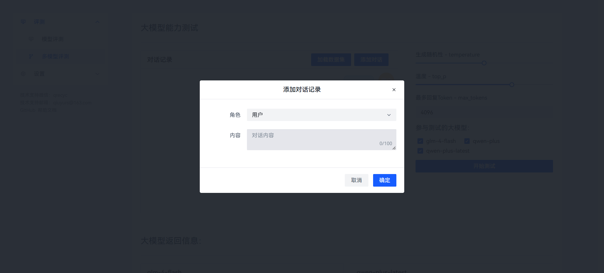
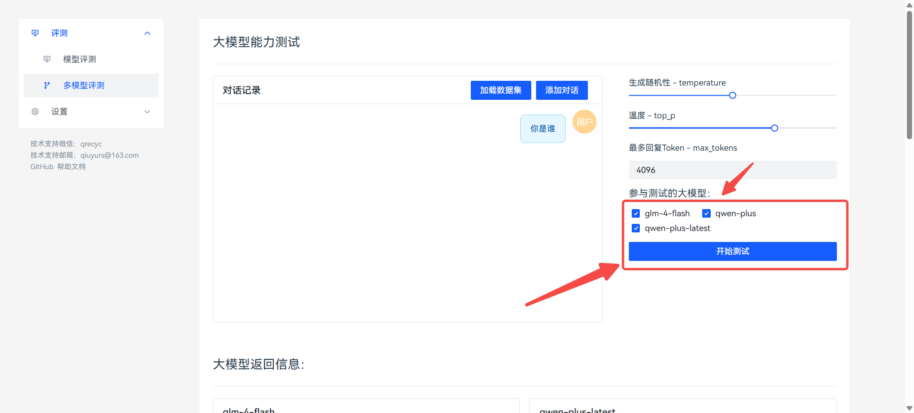
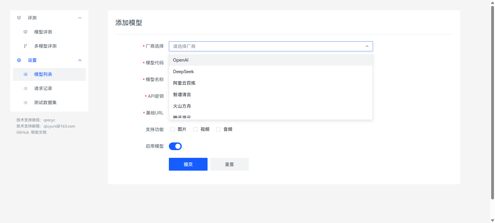
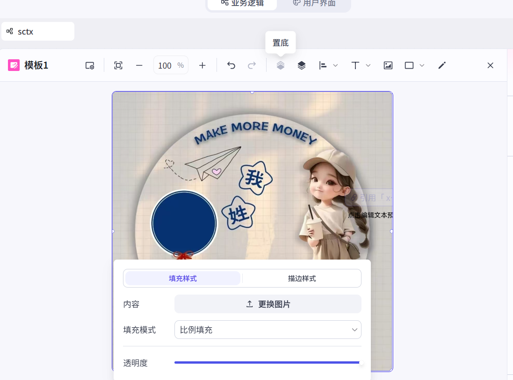

**coze治愈系姓氏头像工作流：小白也能轻松上手学会画板节点**

这个工作流很简单，却很有用。总共只有8个节点，简单快速入门工作流开发

首先，是开始节点，创建工作流自带的，不需要修改任何内容

然后是大模型节点，我这里选择的是"豆包·通用模型·Lite" 这个模型便宜 够用

技能不配置

输入这里选择"开始-user_input" 这个变量是用户输入的内容

接下来是系统提示词：

告诉大模型需要返回什么内容，以什么格式进行返回。

+-----------------------------------------------------------------------------------------+
| 根据用户的问题，解析出以下信息：                                                        |
|                                                                                         |
| name：用户的姓氏                                                                        |
|                                                                                         |
| 谐音梗示例：                                                                            |
|                                                                                         |
| 马到成功 肖兔崽子 蔡貌双全 汪哪里跑                                                     |
|                                                                                         |
| geng：用户姓氏开头的谐音梗，需要以姓氏开头。有趣 幽默                                   |
| 网络热梗（不包含姓氏）2-4字。只返回梗，不要返回其他内容。示例：马到成功，只返回"到成功" |
|                                                                                         |
| 不要返回无关内容。                                                                      |
+-----------------------------------------------------------------------------------------+

其中name返回的是用户的姓氏，就是下图中的"章"

geng返回的是姓氏的谐音梗。"显身手"

再下来的问答节点，这里提供两个选项，"帅气男孩"和"甜美女孩"，分别对应了两个底图。

根据用户选择进入相应的节点。

如：选择"帅气男孩"则进入画板-谐音梗-少年节点。选择"帅气女孩"则进入谐音梗-少女节点。

注意：其他选项也必须连接到下一个节点（连接到结束节点即可）。实际上，用户看不到这个选择，是不会选择的。

这个画板节点是本章中最重要的节点

元素设置这个是需要显示在图片上的内容变量，我这里引用了name和geng两个变量，分别对应"李"和"栗子李"这两个文本内容

首先，点击这个按钮，放大画布。我们需要用到以下两个节点

{width="5.75in"
height="3.9791666666666665in"}

我们创建的是头像，所以要修改画布尺寸为1:1

接下来，上传底图，选择要上传的图片

调整底图的位置，拉动调整到覆盖整个白色背景

在右上角，引用内容变量，并调整到合适的位置

下一个内容同理。

由于我们有两个画板节点，并不确定走哪一条路，所以后面有一个"变量聚合节点"

在这个节点引用前两个画板节点的返回值，将第一个返回的内容进行输出（不能直接连接到结束节点，会报错）

接下来就是连接到结束节点

输出变量为前面变量聚合节点返回的内容

然后使用MarkDown格式进行输出。

