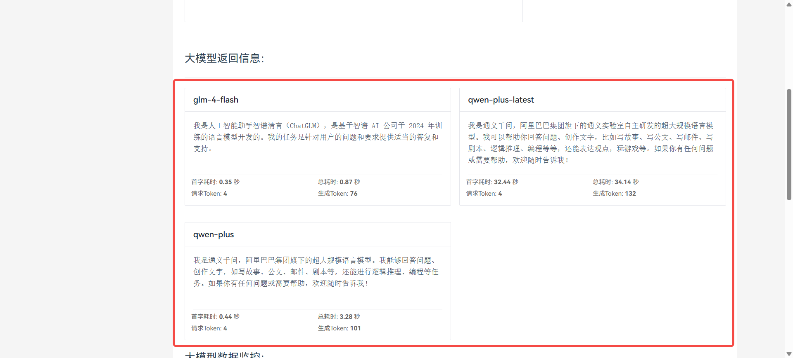
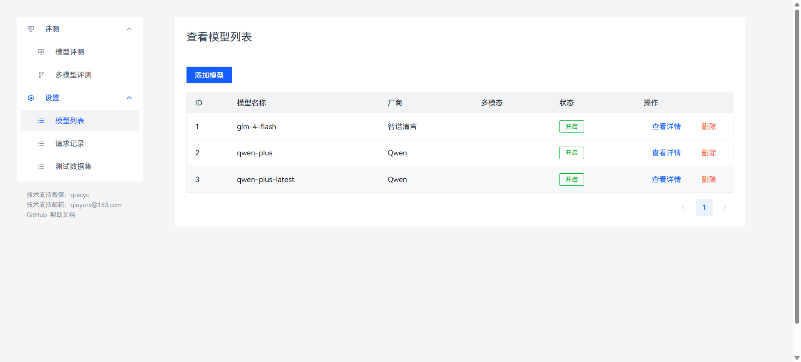

** 使用JWT获取Access Token**

授权流程如下：

在扣子平台创建 OAuth 应用。

应用程序通过公钥和私钥签署 JWT。

应用程序通过 [通过 JWT 获取 Oauth Access
Token](https://www.coze.cn/open/docs/developer_guides/oauth_jwt#a458f4b1)
API，获取访问令牌。

应用程序根据访问令牌调用扣子 API。

**创建应用**

首先，创建一个新应用

客户端类型选择"服务类应用"，其他的随意

{width="5.75in"
height="3.5729166666666665in"}

创建Key，此时会自动下载一个文件。文件里面是私钥，

红框中这一串是公钥，记住这两个值

权限根据自己的需要选择，如果调用Chat SDK的话，选择以下四个权限：

Bot管理

会话管理

文件

消息

点击确定，此时会让你同意授权，继续点击确定

{width="5.75in"
height="4.239583333333333in"}

最后，记录住这个应用ID

{width="5.75in"
height="1.6145833333333333in"}

我们一个需要三个Key，分别是：应用ID、公钥、私钥

**签署JWT**

**Header参数**

+-----------------------------------------------------------------------+
| {                                                                     |
|                                                                       |
| "alg": "RS256", // 固定为RS256                                    |
|                                                                       |
| "typ": "JWT", // 固定为 JWT                                       |
|                                                                       |
| "kid": "gdehvaDegW/....." // 刚才创建应用的公钥                   |
|                                                                       |
| }                                                                     |
+-----------------------------------------------------------------------+

**Payload参数**

+-----------------------------------------------------------------------+
| {                                                                     |
|                                                                       |
| "iss": "310000000002", // OAuth 应用的 ID                         |
|                                                                       |
| "aud": "api.coze.cn", //扣子 API 的Endpoint，固定                 |
|                                                                       |
| "iat": 1516239022, // 现在的时间戳                                  |
|                                                                       |
| "exp": 1516259022, // JWT过期时间，秒级时间戳                       |
|                                                                       |
| "jti": "fhjashjgkhalskj", // 随机字符串，防止重放攻击             |
|                                                                       |
| "session_name":"1234" // 访问令牌的会话标识                       |
|                                                                       |
| }                                                                     |
+-----------------------------------------------------------------------+

注意这个session_name参数，这是Chat SDK中实现用户会话隔离的唯一方法。

请保证这个参数每个用户是唯一且不重复。

如果重复或未指定 session_name，不同用户的对话历史可能会掺杂在一起。

**生成JWT**

参考以下Python代码，生成JWT

**/[generate_jwt.py/]**

{width="5.75in"
height="1.1770833333333333in"}

获取到这段字符串

**获取Access Token**

根据以下格式发送请求，即可获取到Access Token

  -----------------------------------------------------------------------
  sql/
  curl /--location /--request POST
  /'https://api.coze.cn/api/permission/oauth2/token/'/
  /--header /'Content-Type: application/json/'/
  /--header /'Authorization: Bearer JWT字符串/'/
  /--data /'{/
  "duration_seconds": 86399,/
  "grant_type": "urn:ietf:params:oauth:grant-type:jwt-bearer"/
  }/'

  -----------------------------------------------------------------------

对此，继续提供封装好的Python 函数，可以直接调用

获取到以下Token

**/[get_access_token.py/]**

{width="5.75in"
height="0.5208333333333334in"}

后续可用这个Token发起任何请求
