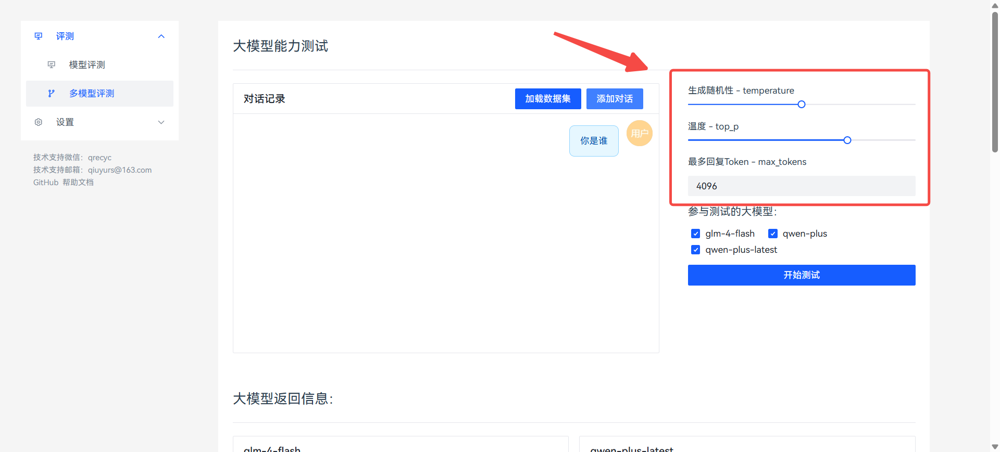
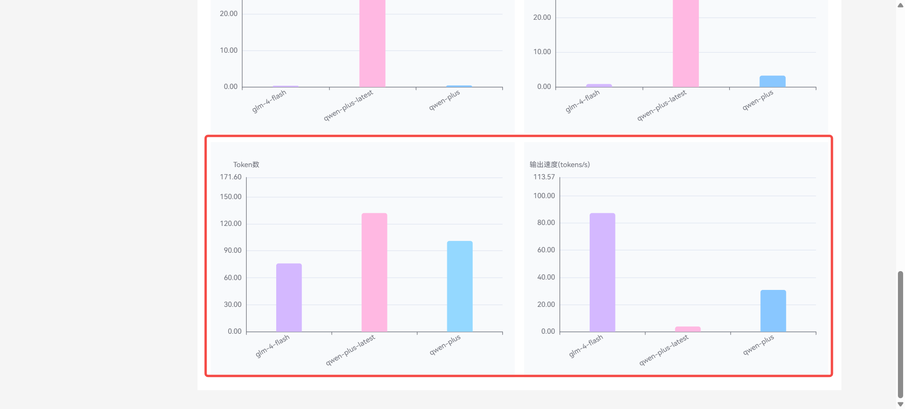

**实战开发coze应用-姓氏头像生成器（下）**

在上篇文章中，我们完成了"用户界面"的配置，下面我们就要进行头像生成的逻辑配置了

选择页面逻辑-工作流的+号，新建工作流

选择刚才新建的工作流

点击开始节点

基础上设置，新增两个变量

变量名：xingshi、类型String 必填 用户的姓氏

变量名：tid、类型Integer 必填 用户选择的头像模板

然后添加一个大模型节点

将开始节点连接到大模型节点

模型选择豆包·Lite即可

技能这里添加"必应搜索"

系统提示词可以参考我这个，生成一个短语

+-----------------------------------------------------------------------------------------+
| 根据用户的问题，解析出以下信息：                                                        |
|                                                                                         |
| name：用户的姓氏                                                                        |
|                                                                                         |
| 谐音梗示例：                                                                            |
|                                                                                         |
| 马到成功 肖兔崽子 蔡貌双全 汪哪里跑                                                     |
|                                                                                         |
| dy：用户姓氏开头的谐音梗，需要以姓氏开头。有趣 幽默                                     |
| 网络热梗（不包含姓氏）2-4字。只返回梗，不要返回其他内容。示例：马到成功，只返回"到成功" |
|                                                                                         |
| 不要返回无关内容。                                                                      |
+-----------------------------------------------------------------------------------------+

用户提示词选择 input变量

输出格式选择"JSON"

并添加两个变量

name（姓氏）和dy（短语）

接下来添加一个 "选择器"节点

条件这里选择开始节点的tid变量

选择 "等于" ，值就是头像模板

比如值等于1 ，就进入生成头像模板 1的流程

下面添加 画板 节点

连接到选择器

设置两个变量

xingshi和dy，选择大模型返回的变量值

接下来 编辑模板

上传头像模板

修改画板尺寸

将背景图铺满屏幕并置底

拖动变量，放在合适位置，调整颜色 大小 字体等

然后重复四次

将四个模板全部设置好

我这里是为了演示，所以并没有微调，做出来可能会有点丑，见笑了

接下来添加变量聚合节点，将生成的图片返回到用户

将几个画板节点返回的值都添加进去

最后连接到"结束"节点，选择变量聚合的返回值

至此，生成逻辑就完成了。

接下来，继续修改用户界面

添加一个新的页面，用户展示生成结果

添加一个图片组件和按钮

点击 返回首页 按钮

在事件页面，新建事件，

类型-点击时

动作-页面跳转

页面类型-内部页面

选择页面-首页

我们回到首页，点击"立即生成"按钮，选择"事件"页面

新建事件：

类型-点击时

动作-页面跳转

名称自定义，自己知道就行，一会要用

入参选择输入和选择框

不知道是哪的话可以点击左边的"结构"

鼠标悬浮在图层上，可以看到右边会显示一个虚线框框告诉你在选择哪里

接下来 点击图片2 的图片

选择-事件

新建一个事件，加载时调用工作流

工作流参数选择页面入参传递的参数

到此，即为搭建完成！

本章写的逻辑可能有些乱，还请见谅。有问题请留言。
