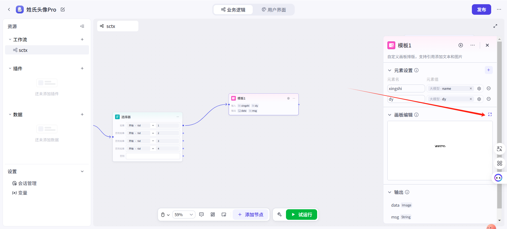
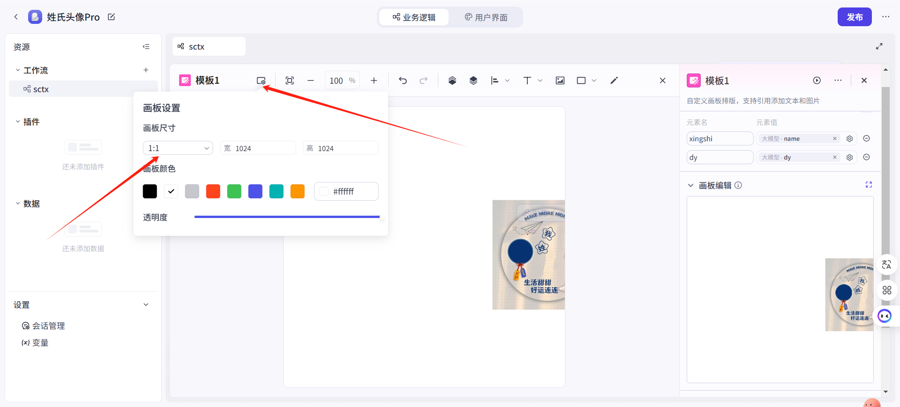
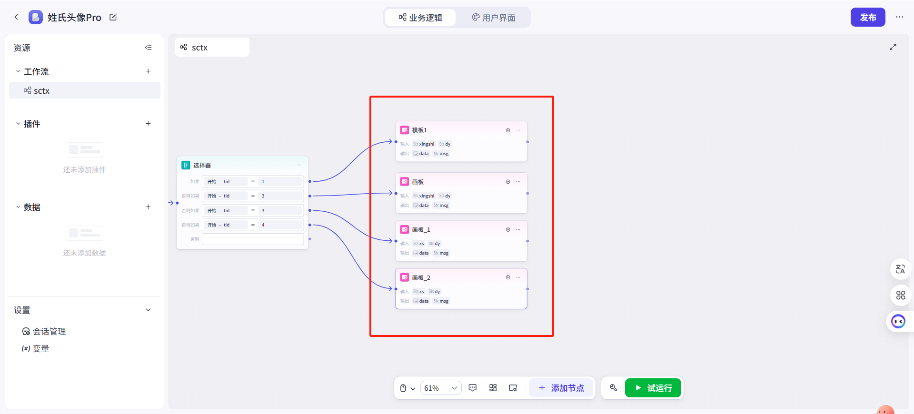

**检查用户的多维表权限**

**需求背景：**

在智能体/AI应用开发过程中，当系统需要对用户的飞书多维表执行查询或写入操作时，若未预先进行权限校验而直接发起操作请求，一旦遭遇用户未授权的情况，系统将抛出异常错误。

这种处理方式存在两个显著问题：

其一，会导致工作流非正常中断，严重影响终端用户的操作体验；

其二，会因无效的API调用造成Tokens资源浪费，进而产生不必要的运营成本。

这种技术实现方式在系统健壮性和资源利用率方面均存在优化空间。

**工作流**

实际工作流

**创建多维表**

调用官方的
[飞书多维表](https://www.coze.cn/store/plugin/7395043460165779483)
插件 - create-base 工具，创建多维表

name随意填写，注意开启【异常忽略】功能

在没有授权的情况下，会提示错误。而警告中的auth_info下就是用户的授权链接

**选择器节点**

在多维表插件后方，接一个【选择器】节点，值选择多维表节点的【errBody】变量

条件选择【不为空】

**True流程**

如果结果为【True】也就是，errorBody这个变量不为空，创建多维表失败了

下面接一个【代码】节点，获取到用户专属的【授权链接】

输入变量为【input】引用多维表插件的错误信息

输出变量为【URL】就是用户的授权链接

代码选择Python，输入以下内容：

  -----------------------------------------------------------------------
  python/
  import json/
  /
  async def main(args: Args) -/> Output:/
  params = args.params/
  /
  /# 1. 解析 input（因为它是一个 JSON 字符串）/
  try:/
  input_data = json.loads(params/[/'input/'/]) /# 解析外层 JSON/
  except json.JSONDecodeError:/
  return {"error": "Invalid JSON format in params/[/'input/'/]"}/
  /
  /# 2. 检查是否有 auth_info 字段/
  if not isinstance(input_data, dict) or "auth_info" not in
  input_data:/
  return {"error": "Missing /'auth_info/' in input data"}/
  /
  /# 3. 提取 auth_info 的 URL/
  auth_url = input_data/["auth_info"/]/
  /
  /# 4. 返回结果/
  return {"url": auth_url}

  -----------------------------------------------------------------------

**False流程**

如果结果为【False】也就是，errorBody这个变量为空，创建多维表成功

后面接一个【变量】赋值节点

将【get_verify_status】变量的值改为【true】

**变量**

这个变量应该是用户变量，每个用户专属的。

专门用户检测用户是否授权，默认值为fasle，也就是未授权。

**结束**

结束值返回【url】和【status】

status返回值为【True】已授权 【False】未授权

在未授权的情况下，返回【URL】用户授权链接

**试运行**

**未授权情况**

将这个链接，返回给用户，点击授权即可

**已授权情况**

返回【True】，用户已经授权

**实际使用**

在已授权状态下，可进行其他操作

在未授权情况下，禁止其他操作。并提醒用户【点击授权】按钮，授予多维表操作权限
