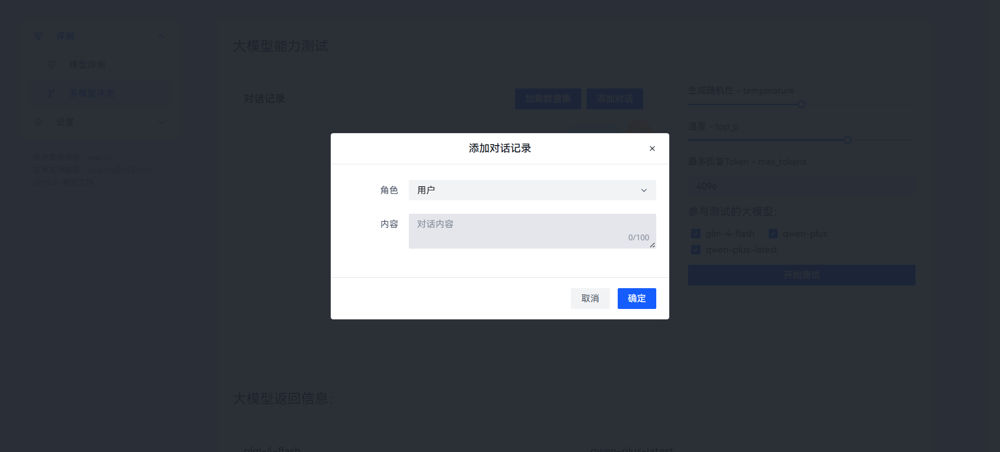
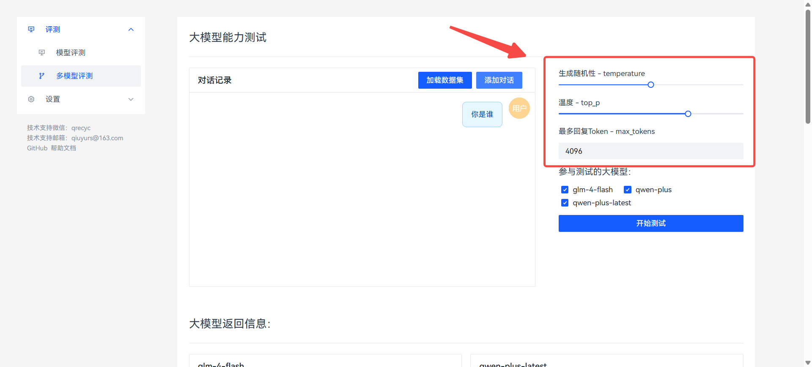
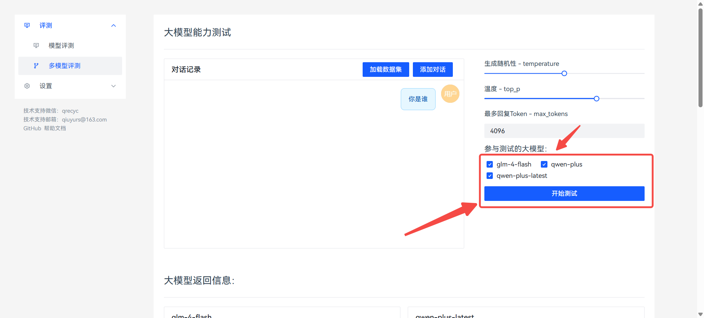
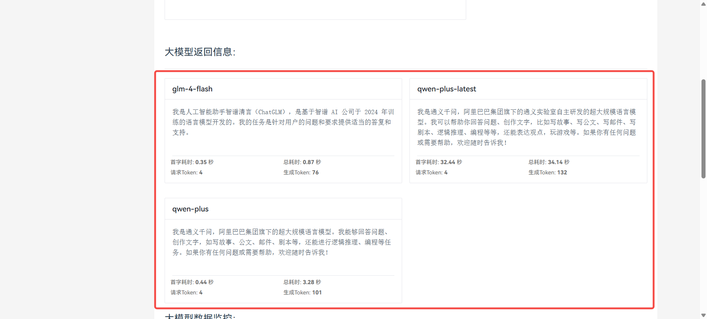
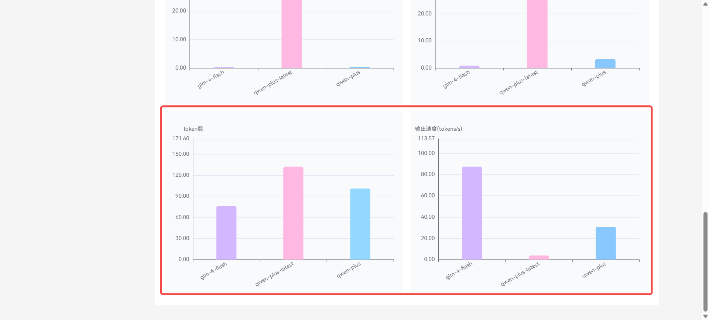

** 纯前端部署多Agents**

纯前端网页搭建，无需任何后端代码，方便快捷！

就像公司前台的多功能控制台，员工可以通过按钮快速呼叫不同的AI助手。具备多设备适配、智能对话等基础能力。

支持添加多个智能体

**配置方式**

添加智能体信息，data-bot为智能体ID

在Coze编辑页面获取

{width="5.75in"
height="1.1145833333333333in"}

创建服务类应用 填写相关信息

{width="5.75in"
height="4.197916666666667in"}

**创建多个智能体**

**弹出对话框样式**

**Chat SDK 1.2.0-beta.2 版本**

适配 Chat SDK 1.2.0-beta.2 版本

如果弹窗页面显示模糊，请将cozeWebSDK-config-isIframe的值修改为true

**/[coze.html/]**

**代码**

**/[coze.html/]**
